Retro Programming Works 怀旧编程作品
====================================

被模拟的PC Emulated PC
----------------------

### 年代 Era

* 1995 ~ 1998

### 配置 Configuration

* CPU 80486DX2 66MHz
* 8M RAM
* 512M HDD
* S3 864 Graphics Adapter with 512k VRAM
* CD-ROM
* Sound Blaster 16 With Wavetable Daughterboard
* Mouse
* 56k Modem

主要用途 Main Usage
------------------

* BASIC编程 BASIC Programming
* C/C++编程 C/C++ Programming
* 英语学习 English learning
* 英汉字典 English-Chinese dictionary
* 中英文文字处理 Chinese & English text processing
* 电子表格和图表处理 Spreadsheet and chart processing
* 多媒体光盘浏览 Viewing multimedia CDs
* 图片浏览 Image viewing
* 音乐和视频播放 Music & video playback
* 拨号上网 Surfing online via dial-up network
* 拨号连接远程服务器 Connecting to remote server via dial-up network
* （禁止游戏 NO GAMING）

截图欣赏 Screenshots
-------------------

#### BASIC编程 BASIC Programming

2048游戏 2048 Game  

俄罗斯方块 Tetris  

猜数字游戏 Bulls and Cows  

九九乘法表 9x9 Multiplication Table  
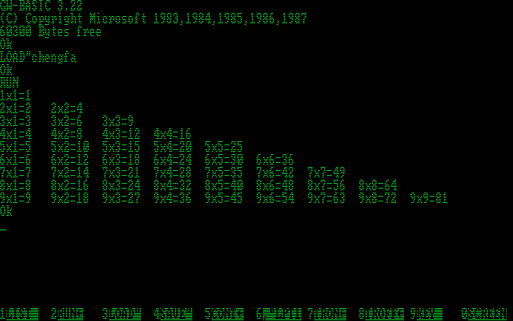

求1000以内的质数 Get prime numbers under 1000  
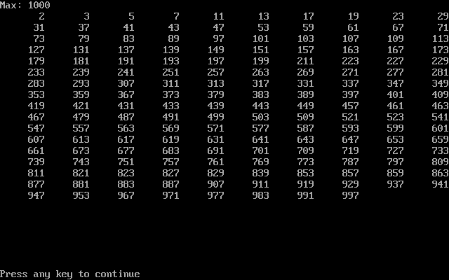

显示杨辉三角 Display Yanghui Triangle  

条形图 Bar Chart  

饼图 Pie Chart  

绘制几何形状 Drawing Geometric Shapes  
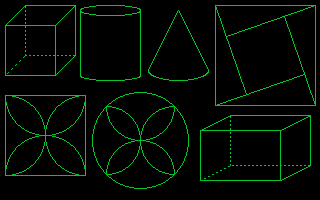

屏保 Screensaver  

屏保（VGA模式） Screensaver (VGA mode)  

谢尔宾斯基地毯 Sierpinski Carpet  

谢尔宾斯基地毯（VGA模式） Sierpinski Carpet (VGA mode)  

数独求解程序 Sudoku Solver  

显示古诗 Poem Showing  

显示古诗（使用BSAVE图像数据） Poem Showing (Using BSAVE Image Data)  
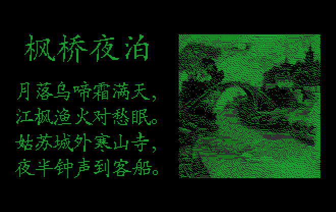

新年快乐 Happy New Year  

诸事皆顺 Everything Goes Well  

月亮河 *Moon River*  

图案 Patterns  
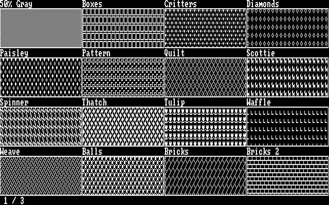  
  
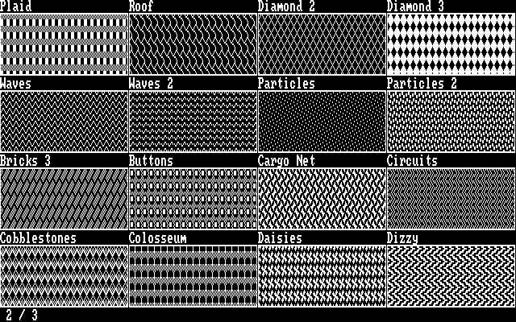  
  
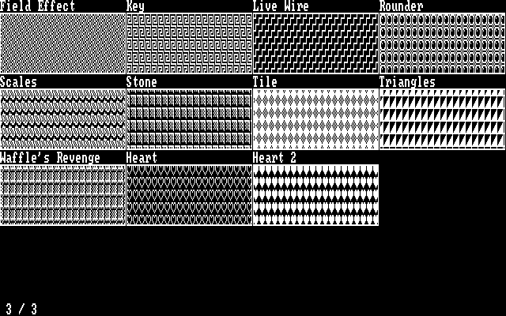

中文数字 Chinese Number  
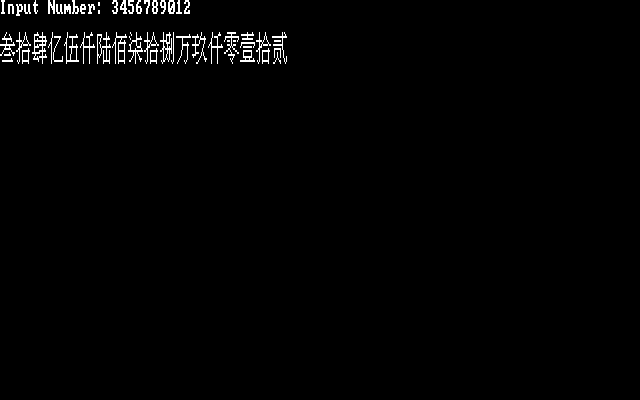

罗马数字 Roman Number  

24点求解器 24 Game Solver  

显示古诗（使用UCDOS特显程序） Poem Showing (Using UCDOS Special Display Tool)  

显示带插图的古诗（使用UCDOS特显程序） Poem With Picture (Using UCDOS Special Display Tool)  

新年快乐（使用UCDOS特显程序） Happy New Year (Using UCDOS Special Display Tool)  

2048游戏（使用UCDOS特显程序） 2048 Game (Using UCDOS Special Display Tool)  

UCDOS特显程序256色列表 256-Color Table of UCDOS Special Display Tool  
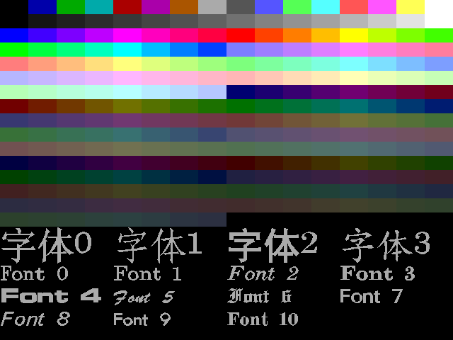

UCDOS特显程序可用字体 Fonts available for UCDOS Special Display Tool  
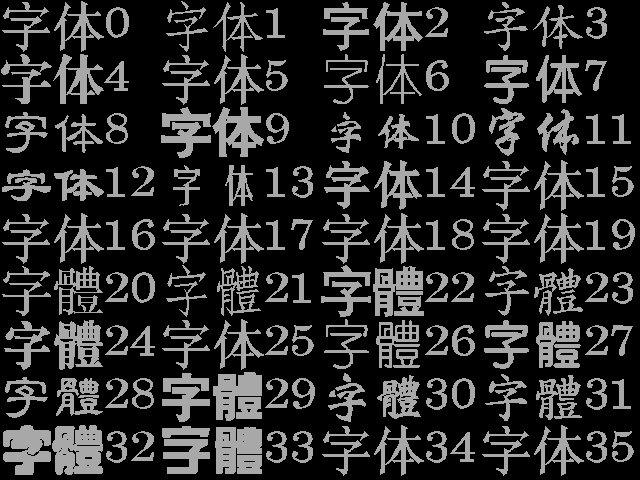

UCDOS可用英文字体 English fonts available for UCDOS  
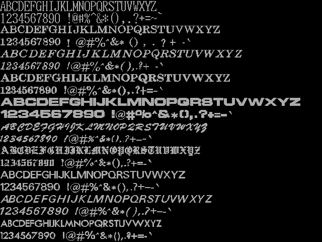

#### C/C++编程 C/C++ Programming

中文数字 Chinese Number  

IP地址计算器 IP Address Calculator  

UCDOS下运行IP地址计算器 IP Address Calculator Under UCDOS  

#### PPP服务器 PPP Server

天气预报 Weather Forecast  

我的博客 My Blog  

带数学公式的文章 Article with Equation  

实用命令 Useful Commands
------------------------

Linux下挂载虚拟软盘（使用GB2312编码的文件名）  
Mount floppy image under Linux (Use GB2312 for filename encoding)

	sudo mount -o loop,codepage=936,iocharset=utf8 floppy.img /mnt

使用ffmpeg制作可在Windows 3.1下播放的视频  
Convert video into format accepted by Windows 3.1

	ffmpeg -i input.mp4 -c:v cinepak|msvideo1 -c:a pcm_s16le|pcm_u8|adpcm_ima_wav\
		-vf "scale=320:240:force_original_aspect_ratio=decrease,pad=320:240:(ow-iw)/2:(oh-ih)/2"\
		-r 12 -ac 1 -ar 22050 -y output.avi

使用ffmpeg制作VCD  
Convert video into VCD

	ffmpeg -i input.mp4 -target pal-vcd|ntsc-vcd output.mpg
	vcdimager -t vcd2 -l "Movie Title" -c output.cue -b output.bin output.mpg

使用ffmpeg制作VCD并将源视频分成多长碟片（每张碟片最长1小时）  
Convert video into VCD and split the source video into multiple discs (Maximum 1 hour for each disc)

	ffmpeg -ss 00:00:00 -t 00:60:00 -i input.mp4 -target pal-vcd|ntsc-vcd output1.mpg
	vcdimager -t vcd2 -l "Part 1" -c output1.cue -b output1.bin output1.mpg
	ffmpeg -ss 00:60:00 -t 00:30:00 -i input.mp4 -target pal-vcd|ntsc-vcd output2.mpg
	vcdimager -t vcd2 -l "Part 2" -c output2.cue -b output2.bin output2.mpg

Windows 3.2和Windows 95使用**金山影霸II**播放PAL制式VCD，使用XingMPEG Player播放NTSC制式VCD。  
Under Windows 3.2 and Windows 95, use SoftVCD II (JinShanYinBa II) to play PAL VCD, use XingMPEG Player to play NTSC VCD.

DOSBox使用的Autoexec命令，用于挂载原始硬盘镜像和软盘镜像  
DOSBox autoexec command for mounting raw harddisk image and floppy image

	@imgmount 0 /home/frank/.dosbox/floppy.img -fs none
	@imgmount 2 /home/frank/.dosbox/hdd.img -fs none -t hdd -size 512,63,16,X

对于一些BIN/CUE，MDF/MDS等非ISO格式的光盘映像文件，可以尝试在Linux下使用`iat`命令转换成ISO文件  
For CD-ROM image files in non-ISO format like BIN/CUE, MDF/MDS, etc., try to use `iat` command under Linux to convert them into ISO file.

### 减少CPU占用 Reduce CPU Usage

**如何在使用模拟器运行DOS、Windows 3.x、Windows 9x时减少CPU占用：**  
**How to reduce CPU usage when running DOS, Windows 3.x, Windows 9x with emulators:**

MS-DOS 6.22自带`POWER.EXE`，在`CONFIG.SYS`里添加以下配置即可：  
MS-DOS 6.22 already has `POWER.EXE` installed, you can add the following configuration into `CONFIG.SYS`:

	DEVICEHIGH=C:\DOS\POWER.EXE ADV:MAX

其它版本的MS-DOS需要将`IDLE.COM`复制到`C:\`，然后从`AUTOEXEC.BAT`运行该命令。  
For other versions of MS-DOS, copy `IDLE.COM` to `C:\`, then run it from `AUTOEXEC.BAT`。

* `IDLE.COM`可以在*Microsoft Virtual PC 2007*中找到。  
`IDLE.COM` can be found from *Microsoft Virtual PC 2007*.

Windows 3.x需要将`WQGHLT.386`复制到`C:\WINDOWS\SYSTEM\`，然后打开`C:\WINDOWS\SYSTEM.INI`并在`[386enh]`小节中添加以下配置：  
For Windows 3.x, copy `WQGHLT.386` to `C:\WINDOWS\SYSTEM\`, then open `C:\WINDOWS\SYSTEM.INI` and add the following configuration into `[386enh]` section:

	device=wqghlt.386

Windows 9x需要安装*AmnHLT*或*Amn Refrigerator*。  
Windows 9x requires installing *AmnHLT* or *Amn Refrigerator*.

### DOS下启用UMB Activate UMB for DOS

在`CONFIG.SYS`中找到内容为`DEVICE=C:\DOS\EMM386.EXE`的行，然后在其后面加上`NOEMS`参数。  
Open `CONFIG.SYS` and find the line with `DEVICE=C:\DOS\EMM386.EXE`, then append `NOEMS` parameter to it.

### DOS下添加CD-ROM支持 Add CD-ROM support for MS-DOS

将`OAKCDROM.SYS`复制到`C:\`（`OAKCDROM.SYS`可在Windows 9x的安装光盘中找到）。  
Copy `OAKCDROM.SYS` to `C:\` (`OAKCDROM.SYS` can be found from Windows 9x installation CD-ROMs).

如果MSCDEX没有安装，需要将`MSCDEX.EXE`复制到`C:\`。  
Copy `MSCDEX.EXE` to `C:\` if MSCDEX is not installed.

在`CONFIG.SYS`中添加以下配置：  
Add the following configuration into `CONFIG.SYS`:

	DEVICEHIGH=C:\OAKCDROM.SYS /D:CD1
	LASTDRIVE=Z

在`AUTOEXEC.BAT`中添加以下命令：  
Add the following command into `AUTOEXEC.BAT`:

	LH MSCDEX.EXE /D:CD1 /L:Z

`/L:Z`用来指定CD-ROM对应的盘符。  
`/L:Z` specifies the drive letter for CD-ROM.

### 如何在Windows 3.x下安装S3显卡驱动 How to install S3 video driver for Windows 3.x

安装Windows 3.x时使用标准VGA显示驱动，安装完成后在“Windows 设置程序”中更改显卡驱动。  
Use the basic VGA driver for the initial install, then change the video driver using Windows Setup in the Main program group.

安装显卡驱动时如果提示插入S3 Trio 64V Flat Mode Driver软盘，则此时需要将路径填写成`C:\WINDOWS\SYSTEM\`以完成显卡驱动的安装。  
When the driver spouted up a prompt to Insert the Trio 64V Flat Mode Driver disk, redirect the installer to `C:\WINDOWS\SYSTEM\` to complete the graphics driver install.

### Windows 3.x下使用DOSBox-x的打印机 Use DOSBox-x's printer under Windows 3.x

选择`Epson LQ1600K`作为打印机驱动程序，之后可以从Windows 3.x的应用程序中使用DOSBox-x的虚拟打印机打印到PNG图片。  
Select `Epson LQ1600K` as the printer driver, then you can print document into PNG files from Windows 3.x applications via DOSBox-x's virtual printer.

### 不同Linux环境安装编译环境的方式 How To Install Build Environment for Linux

* Debian/Ubuntu: `sudo apt-get install build-essential`
* Tiny Core: `tce-load -wi compiletc`
