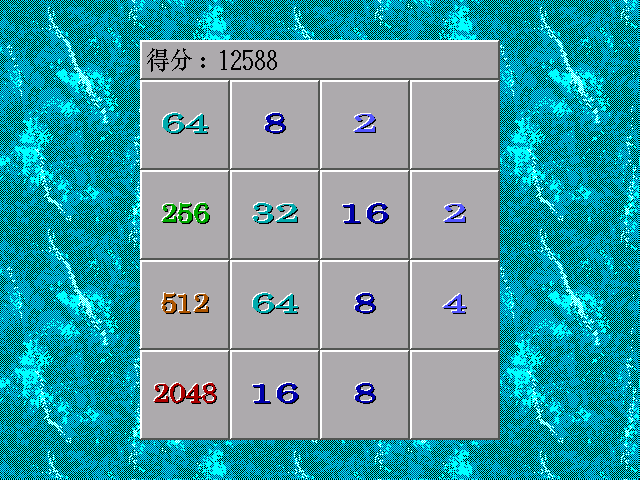

Retro Programming Works 怀旧编程作品
====================================

被模拟的PC 1 Emulated PC 1
------------------------

### 年代 Era

* 1995 ~ 1998

### 配置 Configuration

* CPU 80486DX2 66MHz
* 8M RAM
* 512M HDD
* S3 864 Graphics Adapter with 512k VRAM
* CD-ROM
* Sound Blaster 16 With Wavetable Daughterboard
* Mouse
* 56k Modem

### 主要用途 Main Usage

* BASIC编程 BASIC Programming
* C/C++编程 C/C++ Programming
* 英语学习 English learning
* 英汉字典 English-Chinese dictionary
* 中英文文字处理 Chinese & English text processing
* 电子表格和图表处理 Spreadsheet and chart processing
* 多媒体光盘浏览 Viewing multimedia CDs
* 图片浏览 Image viewing
* 音乐和视频播放 Music & video playback
* 拨号上网 Surfing online via dial-up network
* 拨号连接远程服务器 Connecting to remote server via dial-up network
* （禁止游戏 NO GAMING）

被模拟的PC 2 Emulated PC 2
-------------------------

### 年代 Era

* 1990 ~ 1992

### 配置 Configuration

* CPU: 8088 4.77MHz
* RAM: 640k
* Floppy Drive A: 5.25" 360k Double Side
* Floppy Drive B: 5.25" 360k Double Side
* Display: CGA with green monochrome monitor

### 主要用途 Main Usage

* BASIC编程 BASIC Programming
* WPS中英文文字处理 WPS Chinese & English Text Processing
* 俄罗斯方块游戏 Tetris game
* 2048游戏 2048 Game

截图欣赏 Screenshots
-------------------

#### C/C++编程 C/C++ Programming

IP地址计算器 IP Address Calculator  

UCDOS下运行IP地址计算器 IP Address Calculator Under UCDOS  

中文数字 Chinese Number  

#### PPP服务器 PPP Server

天气预报 Weather Forecast  

我的博客 My Blog  

带数学公式的文章 Article with Equation  

#### BASIC编程 BASIC Programming

2048游戏 2048 Game  

2048游戏（使用UCDOS特显程序） 2048 Game (Using UCDOS Special Display Tool)  

俄罗斯方块 Tetris  

贪吃蛇游戏 Snake Game  

猜数字游戏 Bulls and Cows  

24点求解器 24 Game Solver  

数独求解程序 Sudoku Solver  

谢尔宾斯基地毯（VGA模式） Sierpinski Carpet (VGA mode)  

谢尔宾斯基地毯 Sierpinski Carpet  

显示古诗（使用UCDOS特显程序） Poem Showing (Using UCDOS Special Display Tool)  

显示古诗 Poem Showing  

显示带插图的古诗（使用UCDOS特显程序） Poem With Picture (Using UCDOS Special Display Tool)  

显示古诗（使用BSAVE图像数据） Poem Showing (Using BSAVE Image Data)  

新年快乐（使用UCDOS特显程序） Happy New Year (Using UCDOS Special Display Tool)  

新年快乐 Happy New Year  

诸事皆顺（使用UCDOS特显程序） Everything Goes Well (Using UCDOS Special Display Tool)  

诸事皆顺 Everything Goes Well  

图案（VGA模式） Patterns (VGA mode)  
  
  
  

繁花曲线（VGA模式） Flower Curves (VGA mode)  

繁花曲线 Flower Curves  

中文数字 Chinese Number  

猜数字求解器 Bulls and Cows Solver  

九九乘法表 9x9 Multiplication Table  

斐波那契数列 Fibonacci Sequence  

显示杨辉三角 Display Yanghui Triangle  

实用命令 Useful Commands
------------------------

### 制作VCD并在Windows 95下播放

使用ffmpeg制作VCD  
Convert video into VCD

	ffmpeg -i input.mp4 -target pal-vcd|ntsc-vcd output.mpg
	vcdimager -t vcd2 -l "Movie Title" -c output.cue -b output.bin output.mpg

使用ffmpeg制作VCD并将源视频分成多长碟片（每张碟片最长1小时）  
Convert video into VCD and split the source video into multiple discs (Maximum 1 hour for each disc)

	ffmpeg -ss 00:00:00 -t 00:60:00 -i input.mp4 -target pal-vcd|ntsc-vcd output1.mpg
	vcdimager -t vcd2 -l "Part 1" -c output1.cue -b output1.bin output1.mpg
	ffmpeg -ss 00:60:00 -t 00:30:00 -i input.mp4 -target pal-vcd|ntsc-vcd output2.mpg
	vcdimager -t vcd2 -l "Part 2" -c output2.cue -b output2.bin output2.mpg

Windows 95使用**金山影霸II**播放PAL制式VCD，使用XingMPEG Player播放NTSC制式VCD。  
Under Windows 3.2 and Windows 95, use SoftVCD II (JinShanYinBa II) to play PAL VCD, use XingMPEG Player to play NTSC VCD.

### 其它 Miscellaneous

Linux下挂载虚拟软盘（使用GB2312编码的文件名）  
Mount floppy image under Linux (Use GB2312 for filename encoding)

	sudo mount -o loop,codepage=936,iocharset=utf8 floppy.img /mnt

对于一些BIN/CUE，MDF/MDS等非ISO格式的光盘映像文件，可以尝试在Linux下使用`iat`命令转换成ISO文件  
For CD-ROM image files in non-ISO format like BIN/CUE, MDF/MDS, etc., try to use `iat` command under Linux to convert them into ISO file.

